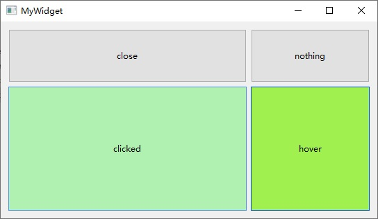

# QT UI练习内容（QT UI Practice Content）：
## 1. QT的UI相关功能
QT的UI消息响应（信号和槽机制），按钮样式修改，自定义按钮；
## 2. QT生成的exe程序打包，两种方式：
### 2.1 使用QT自带的windeployqt打包
(a)使用windeployqt把exe所依赖的Qt 库 DLL、、翻译文件（ .qm ）等复制到 EXE 所在的目录；  
(b)手动添加非 Qt 依赖，windeployqt 只负责 Qt 自身的依赖，项目依赖的非Qt的DLL文件需要手动复制到 exe 目录中。
### 2.2 使用Enigma Virtual Box软件
使用Enigma Virtual Box软件把exe和所依赖的dll文件整合到一个exe文件中，不会损失运行效率。  
Enigma Virtual Box项目: qtuitest_boxed.evb，生成的单一exe可执行文件: qtuitest_packdemo.part1.rar、qtuitest_packdemo.part2.rar
# 参考文件：
[1]. QT中提升为自定义控件的方法 - 知乎  
[2]. Windows下将QT打包为可执行文件（exe）的完整流程，包含第三方库。 - 笑眯眯办大事 - 博客园

# QT UI Practice Content（QT UI练习内容）：
## 1. QT UI-related Functions
QT's UI message response (Signal and Slot Mechanism), button style modification, and custom buttons
## 2. Packaging of EXE Programs Generated by QT (Two Methods)
### 2.1 Packaging with QT's Built-in windeployqt
 (a) Use windeployqt to copy the Qt library DLLs, translation files (.qm files), and other dependencies required by the EXE to the directory where the EXE is located.  
 (b) Manually add non-Qt dependencies: windeployqt only handles Qt's own dependencies; non-Qt DLL files that the project depends on need to be manually copied to the EXE directory.
### 2.2 Using Enigma Virtual Box Software
Integrate the EXE and its dependent DLL files into a single EXE file without losing operational efficiency.
# Reference Documents
[1]. QT中提升为自定义控件的方法 - 知乎  
[2]. Windows下将QT打包为可执行文件（exe）的完整流程，包含第三方库。 - 笑眯眯办大事 - 博客园

#程序运行界面：

